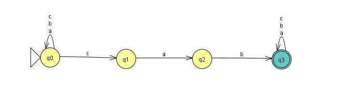

# Simulador de Autômatos Finitos

Implementação do Simulador de Autômatos Finitos.<br><br>
Os objetivos dos algoritmos são:

- A leitura dos arquivos do tipo JSON e CSV
- O algoritmo de Simulação
- O arquivo de saida do tipo CSV

## O arquivo JSON
O arquivo representa um autômato com seus estados e transições, onde from: é o estado atual, to: é o estado após o verificar o símbolo e read: é o símbolo que se deseja para realizar a transição.

```json
{
  "initial": 0,
  "final" : [3],
  "transitions": [
    {
      "from": "0",
      "to": "0",
      "read": "a"
    },
    {
      "from": "0",
      "to": "0",
      "read": "b"
    },
    {
      "from": "0",
      "to": "0",
      "read": "c"
    },
    {
      "from": "3",
      "to": "3",
      "read": "a"
    },
    {
      "from": "3",
      "to": "3",
      "read": "b"
    },
    {
      "from": "3",
      "to": "3",
      "read": "c"
    },
    {
      "from": "0",
      "to": "1",
      "read": "c"
    },
    {
      "from": "1",
      "to": "2",
      "read": "a"
    },
    {
      "from": "2",
      "to": "3",
      "read": "b"
    }
  ]
}
```
Se interpretarmos o arquivo, perceberemos que o autômato segue essa estrutura:

<table align="center">
  <tr>
    <td align="center">
      
    </td>
  </tr>
</table>

## O arquivo CSV

Diferentemente do arquivo JSON, esse arquivo está representando a sequência de palavras na primeira coluna e o resultado que se espera do processamento da função programa com a palavra ou seja 1-aceita ou 0-rejeita.

 ```csv
abcabac;1
ab;1
cab;1
cababc;1
abccab;1
aaaaa;1
abc;1
bacaaaa;1
```

## Código da Simulação

A linguagem da programação escolhida para realizar o desenvolvimento do código que realiza a simulação é do autômato foi JAVA. <br><br>
Abaixo está o código que realiza a leitura dos arquivos JSON e CSV, apartir dessa leitura é criado duas classes. A classe automato que identifica o estado inicial, transição e o estado final e a classe Transição realiza o mesmo procesimento, armazena o estado inicial, transição e o estado.<br><br>
A verificação do tipo do autômato ocorre com um loop que analisa se existe mais de um from com o mesmo read, ou seja outros estados com o mesmo símbolo, se existir mais de um estado então o autômato é não deterministico se esse não for o caso então é deterministico.<br><br>
Após o reconhecimento do tipo do autômato, através de um loop e a leitura do CSV será acessado a simulação de acordo com o tipo do autômato, a cada resultado do processamento da palavra com a função programa é chamado a função para escrever o arquivo de saida em CSV.<br><br>
Durante a execução do loop é adicionado à lista de saida a palavra, o resultado esperado(arquivo de teste CSV), resultado obtido (após a execução da função simulacao é retornado se a função programa aceita a palavra ,ou seja, 1-true ou 0-false) e o tempo de execução para a simulação em nanosegundo, assim que finalizar o loop é chamado a função escrever CSV que gera o arquivo usando a lista criada.<br><br>

- Classe Automato:
```java
public class Automato {
    private int initial;
    private List<Integer> _final;
    private List<Transicao> transitions;

    public int getInitial() { 
        return initial; 
    }
    
    public void setInitial(int initial) {
        this.initial = initial; 
    }

    public List<Integer> getFinal() {
        return _final; 
    }
    
    public void setFinal(List<Integer> _final) {
        this._final = _final; 
    }

    public List<Transicao> getTransitions() {
        return transitions; 
    }
    
    public void setTransitions(List<Transicao> transitions) {
        this.transitions = transitions; 
    }
}
```

- Classe Transicao:
```java
public class Transicao {
    private int from;
    private int to;
    private String read;

    // Getters e setters
    public int getFrom() { 
        return from; 
    }
    
    public void setFrom(int from) {
        this.from = from;
    }

    public int getTo() { 
        return to; 
    }
    
    public void setTo(int to) {
        this.to = to; 
    }

    public String getRead() {
        return read; 
    }
    
    public void setRead(String read) {
        this.read = read; 
    }
}
```
- Classe Main(Principal):
```java
public class ProcessarAutomato {

    public static void main(String[] args) {
        try {
            ObjectMapper mapper = new ObjectMapper();
            Automato automato = mapper.readValue(new File("arquivo_do_automato.aut"), Automato.class);

            List<String[]> entradaCsv = lerCSV("arquivo_de_testes.in");
            List<String[]> saidaCsv = new ArrayList<>();

            boolean AFD = ehAFD(automato);
            System.out.println("Tipo de autômato detectado: " + (AFD ? "AFD" : "AFND"));

            for (String[] linha : entradaCsv) {
                String palavra = linha[0];
                int esperado = Integer.parseInt(linha[1]);

                long inicio = System.nanoTime();
                boolean aceitou = AFD
                        ? simulacaoAFD(automato, palavra)
                        : simulacaoAFN(automato, palavra);
                long fim = System.nanoTime();

                saidaCsv.add(new String[]{
                        palavra,
                        String.valueOf(esperado),
                        aceitou ? "1" : "0",
                        String.valueOf(fim - inicio)
                });
            }

            escreverCSV("arquivo_de_saida.out", saidaCsv);
            System.out.println("Processamento finalizado. Arquivo gerado.");

        } catch (Exception e) {
            e.printStackTrace();
        }
    }

    private static boolean ehAFD(Automato automato) {
        Set<String> pares = new HashSet<>();
        for (Transicao t : automato.getTransitions()) {
            String chave = t.getFrom() + ":" + t.getRead();
            if (!pares.add(chave)) return false; 
        }
        return true;
    }

    private static boolean simulacaoAFD(Automato automato, String palavra) {
        int estadoAtual = automato.getInitial();

        for (char c : palavra.toCharArray()) {
            String simbolo = String.valueOf(c);
            boolean encontrou = false;

            for (Transicao t : automato.getTransitions()) {
                if (t.getFrom() == estadoAtual && simbolo.equals(t.getRead())) {
                    estadoAtual = t.getTo();
                    encontrou = true;
                    break;
                }
            }
            if (!encontrou) return false;
        }

        return automato.getFinal().contains(estadoAtual);
    }

    private static boolean simulacaoAFN(Automato automato, String palavra) {
        return aceitaAFNRec(automato, automato.getInitial(), palavra, 0);
    }

    private static boolean aceitaAFNRec(Automato automato, int estadoAtual, String palavra, int pos) {
        if (pos == palavra.length()) {
            return automato.getFinal().contains(estadoAtual);
        }

        String simbolo = String.valueOf(palavra.charAt(pos));
        for (Transicao t : automato.getTransitions()) {
            if (t.getFrom() == estadoAtual && simbolo.equals(t.getRead())) {
                if (aceitaAFNRec(automato, t.getTo(), palavra, pos + 1)) return true;
            }
        }
        return false;
    }

    private static List<String[]> lerCSV(String nomeArquivo) throws IOException {
        List<String[]> linhas = new ArrayList<>();
        BufferedReader br = new BufferedReader(new FileReader(nomeArquivo));
        String linha;
        while ((linha = br.readLine()) != null) {
            linhas.add(linha.split(";"));
        }
        br.close();
        return linhas;
    }

    private static void escreverCSV(String nomeArquivo, List<String[]> linhas) throws IOException {
        BufferedWriter bw = new BufferedWriter(new FileWriter(nomeArquivo));
        for (String[] linha : linhas) {
            bw.write(String.join(";", linha));
            bw.newLine();
        }
        bw.close();
    }
}
```
## O arquivo de saída
Após a execução do código com os arquivos de teste e do autômato o retorno será o arquivo de saída contendo as colunas com a palavra, o resultado esperado, o resultado obtido e o tempo de execução.
```csv
abcabac;1;1;52300
ab;1;0;6800
cab;1;1;19000
cababc;1;1;29100
abccab;1;1;16100
aaaaa;1;0;28600
abc;1;0;9300
bacaaaa;1;0;31200
```
